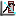

Plotting Tools (1D)
===================

Dawn supplies a variety of tools for interacting with 1-dimensional data (traces apposed to images). These tools are access by clicking on drop down arrow next to the Spanner icon in the plot view toolbar. After selecting a tool the icon changes to reflect the chosen tool.

Items Common to All Tools
-------------------------

The View Menu
+++++++++++++

The view menu contains some of the tool bar actions and:

* Open cheat sheet: Cheat sheets....
* Open in dedicated view: Dedicated view.....

Closing Tools
+++++++++++++

Tools can be closed either by selecting a different tool or the clear tool option or by closing the tool view tab.

|peakicon| Peak Fitting Tool
----------------------------

.. |peakicon|  image:: images/plot-tool-peak-fit.png

.. image:: images/peak_tool_actions.png

The peak fitting tool is designed to automatically identify individual sharp peaks in a data trace (like those found in a powder diffraction).

On selecting the peak fitting tool, the peak fitting tab will be displayed and the mouse pointer will change allowing a region of interest (ROI) to be selected along the x-axis.

Clicking and dragging the mouse pointer defines the region to be fit. The peak fitting happens automatically on release of the mouse button.  The fitted peaks are displayed on the plot; the peak parameters are displayed in the table on the peak fitting tab.

Peak Fitting Tool Actions
+++++++++++++++++++++++++

* New Fit selection: Switches the mouse to x-axis ROI mode, allowing the peak fitting region to be redefined.
* Plot display toggle actions
   * Show/Remove annotation at peak position
   * Show/Remove fitting traces
   * Show/Remove peak lines
   * Show/Remove selection regions for full width half max
* Save peak: Stores current peak in the table (useful for comparing the same fit but with a different peak type etc.). Cleared using
* Peak type to fit: Select peak profile (Gaussian, Lorentzian...)
* Choose trace for fit: Select which of the plotted traces to fit
* Number of peaks to fit: Maximum number of peaks used in the fit. The fitting tool will not fit more peaks than it finds, so the actual number of peaks fit may be less than this number.
* Clear all regions found in the fitting: Removes ROI from plot, all associated peaks, and parameter data from the table
* Delete peak selected, if any: removes peak from table and plot view

View Menu Items
+++++++++++++++
The view menu contains some of the tool bar actions and:

* Preferences...: Shortcut to the fitting preferences where the default accuracy and smoothing can be set

|lineicon| Line Fitting Tool
----------------------------

.. image:: images/line_tool_actions.png

The line fitting tool works in a similar fashion to the peak fitting tool but fits a polynomial rather than a peak.

On selecting the line fitting tool, the line fitting tab will be displayed and the mouse pointer will change allowing a ROI) to be selected along the x-axis.

Clicking and dragging the mouse pointer defines the region to be fit. The line fitting happens automatically on release of the mouse button.  The fitted line is displayed on the plot; the line parameters are displayed in the table on the line fitting tab.

Line Fitting Tool Actions
+++++++++++++++++++++++++

* New Fit selection: Switches the mouse to x-axis ROI mode, allowing the line fitting region to be redefined.
* Plot display toggle actions
   * Show/Remove fitting traces
   * Show/Remove selection regions
* Choose trace for fit: Select which of the plotted traces to fit
* Polynomial order to fit: Select polynomial order (1st, 2nd, 3rd...)
* Clear all regions found in the fitting: Removes ROI from plot, all associated peaks, and parameter data from the table
* Delete line selected, if any: removes line from table and plot view

|dericon| Derivative Tool
-------------------------

The derivative tool allows the first and second derivatives of the data trace to be displayed with or without the original trace.
On selecting the derivative tool, the derivative tab will be displayed and the trace will automatically be shown as first derivative.

The three check boxes on the derivative tab view allow any combination of the data, first derivative and second derivative to be displayed.

|infoicon| XY Information Tool
------------------------------

.. |infoicon| image:: images/info.png

.. image:: images/xyinfo_actions.png

The XY information tool shows the position of the mouse cursor in the plot view and can be used to place point ROIs as markers.

On selecting the XY information tool, the XY information tab will be displayed, showing the current mouse pointer co-ordinates and the mouse pointer will change to crosshairs.

Clicking the mouse button places a point ROI whose position is displayed in the XY information tool tab table.

XY Information Tool Actions
+++++++++++++++++++++++++++

* Copy Values to Clipboard: Copies the  parameters to the clipboard as text
* Delete Selected Region: Deletes the XY parameters from the table and the point ROI from the plot view
* Show Vertices of Visible Regions: Displays the  co-ordinates for point ROI on the plot
* Clear Vertices of Visible Regions: Clears the added co-ordinates

|meaicon| Measurement Tool
--------------------------

The measurement tool allows precise distances to be measured on the plot view.

On selecting the measurement tool, the measurement tab will be displayed and the mouse pointer will change to draw a line ROI.

Clicking and dragging the mouse pointer defines the measurement line region. The line measurement parameters (distance in x and y, line length and angle) for each line draw are shown in the measurement tool tab table.

After the measurement line is drawn it can be moved or changed by clicking on the line ROI in the plot.

Measurement Tool Actions
++++++++++++++++++++++++

* Create New Measurement: Switches the mouse to line ROI mode, allowing a new measurement line to be draw
* Copy Values to Clipboard: Copies the measurement parameters to the clipboard as text
* Delete Selected Region: Deletes the measurement parameters from the table and the measurement line ROI from the plot view
* Show Vertices of Visible Regions: Displays the end co-ordinates for each line ROI on the plot
* Clear Vertices of Visible Regions: Clears the added co-ordinates

|hisicon| History Tool
----------------------

.. |hisicon| image:: images/plot-tool-history.png

The History tool allows data from different files to be shown in the same plot.  It always opens in a dedicated window, since this is required to allow interaction with different plot views showing different data sets.

Selecting the history tool opens the history tab which contains the history actions and a table where traces added to the history are displayed.

History Tool Actions
++++++++++++++++++++

* Automatically add any new plots to the history:
* Add current plots to history
* Delete selected: Removes selected plot from history
* Clear History
* Rename selected: allows the name of the selected trace to be changed

XAFS Analysis Tool
------------------

The XAFS tool contains data processing options specific to the analysis of X-ray absorption fine structure spectra, so is generally only useful for this type of data (although the tool is present for all 1D data types and some calculations will be valid for any data type).

Clicking on the XAFS tool opens the XAFS Analysis tab which contains a plot view and a variety of actions and editable parameters.

The plot view initially displays the first derivative of the data shown in the main plot, but what is shown in the plot view is controlled by the tool actions

XAFS Analysis Tool Actions
++++++++++++++++++++++++++

As well as all the usual actions associated with a plot view the XAFS tool also provides the following actions:

* Show derivative of first set plotted (default view): This is used to show energy profile for placing the a and k start values
* Polynomial filtered noise calculation: shows the noise on the spectrum (i.e. the difference between the data set and one which has been smoothed with polynomial filter), the tool also displays the RMS error of this noise spectrum.  
* Show  normalised data: Performs an XAFS specific normalisation. The a and k values must be set for this calculation to produce acceptable results. The green line shows the pre-edge energy, the red line shows the post edge energy
* Show  normalised data with spline used for background subtraction. Again, a and k must be set.
* Show function after background subtraction
* Show function after Fourier transform
* Guess a and k start values

XAFS Analysis Tool Options and Parameters
+++++++++++++++++++++++++++++++++++++++++

The following options and parameters can either be changed to alter the output of the XAFS analysis algorithms, or show some a value calculated by the tool.

* Pre-edge: Used to set the pre-edge energy value (eV)
* Post-edge: Used to set the post-edge energy value (ev)
* Chebyshev background: select Chebyshev polynomials for the background subtraction
* k-weight
* Max Order
* Interpolate
* Filter
* Fourier RMS error
* Polynomial RMS error