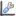
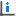

Image Plotting Tools
====================

Images have a range of tools such as zooming and 

The image plotting tools appear automatically when an image (two-dimensional data array) is plotted. 
You can choose an image tool by going to the tool action menu: 

and choosing the kind of tool you would like. The follow section details with what each of the tools do.

**NOTE** All tools which use regions like lines, boxes and sectors may be run with multiple regions. Many
lines for instance may be drawn by the line profile tool. To add another region click the button for the tool
again.

Color Mapping
-------------
.. image:: images/brightness_contrast.png 

The colour mapping tool is used to adjust how the values of intensity are coloured. The colours are assigned
within a maximum and minimum value for intensity. There are also minimum and maximum cut values, outside these
ranges and a value is considered bad and has a special colour. For instance dead pixels blue and zingers red.

Imagining the plotting the intensities with a normal distribution the colour range of the palette and cut offs
is given by:

Pressing the 'h' key with the plot selected will result in the current max and min for the colour range
being reset. 

On the graph tool bar there is a button labelled 'Configure Settings...' :

.. image:: images/Configure.png

This opens a dialog with the tabbed pane 'Image Traces' which allows one to choose a mean based or median based 
assignment for the max and min values.

On the color mapping tool, you may click in the 'Histogram Plot' to move the intensity range manually. The blue area
selected represents the active range of intensities.  

Menubar of Color Mapping
^^^^^^^^^^^^^^^^^^^^^^^^
There is a menu bar at the top of the tool. The action 'Histogram range locked for this image' will lock the max
min in the histogram. If Color Mapping is opened in a dedicated view, it will apply its colour scheme to any image
opened.

Pixel Information
-----------------

Pixel infomation shows the pixel position and its intensity as you move the mouse over the image. In addition 
you may click add points which report the same position. The tool (which works better wide and short in size to
avoid scrolling) also reports q, theta and resolution providing the meta-data can be read out of the
original image.

Toolbar of Pixel Information
^^^^^^^^^^^^^^^^^^^^^^^^^^^^
The toolbar of Pixel Information contains actions which apply to vertices (points created when you click). They
can be deleted or have labels turned on and off.

Line Profile
------------
.. image:: images/plot-tool-line-profile.png

The line profile tool extracts the intensity along a line and plots it in an xy-plot at the side of the image.
You may use peak fitting and other xy-tools on this xy-plot. So for instance a line may pass through several peaks
and then the peak fitting be used to find the fitted maxima.

Toolbar of Line Profile
^^^^^^^^^^^^^^^^^^^^^^^
The toolbar of line profile gives plot options for the line profile plot and contains and extra action for adding
a new line profile.

Box Profile
-----------
.. image:: images/plot-tool-box-profile.png

The box profile tool is the integral of vertical and horizontal intensities of a box drawn on the image.
The box may be dragged around the image and multiple boxes added and compared. You may use peak fitting and other xy-tools on this xy-plot. 

Grid Profile
------------

Radial Profile
--------------

Azimuthal Profile
-----------------

Cross Hair Profile
------------------

Masking
-------

Ellipse Fitting
---------------

Zoom Profile
------------

Image History
-------------

Diffraction
-----------

