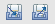
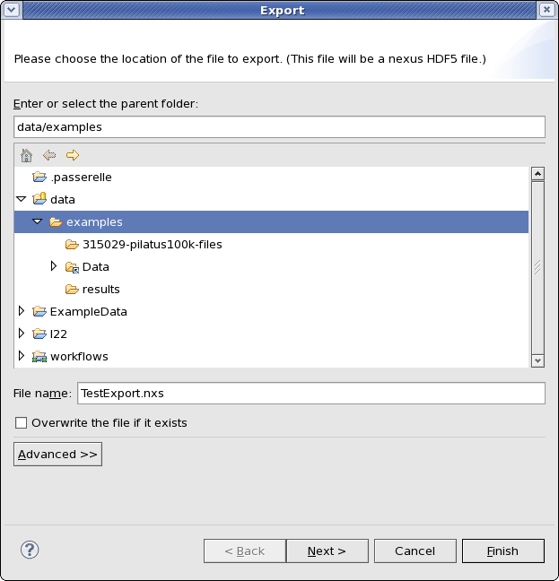
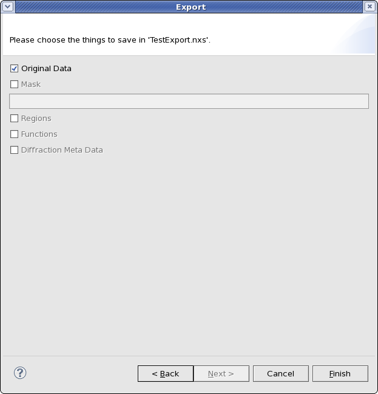
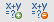
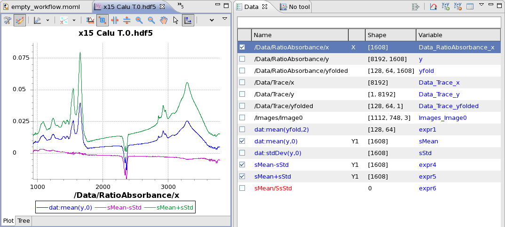

Other Tools
===========

There are more common features found in many tools in Dawn, these include things such as importing/exporting data, and expressions.

Import/Export Data Wizard
-------------------------

The data import/export wizard is used to save images, traces, masks, etc to a Nexus/HDF5 file and reload them for use at a later date.  Exporting and importing data actions are represented by these two buttons:

To export the data, click the export button, and the export wizard should appear:

The first page of the export wizard is used to specify the location where the data should be saved. After a location and file name are entered clicking next brings up the second page of the wizard.

The second page can be used to specified what is saved in the nexus/hdf5 file (data, mask....). Saving masks requires a name to be added for the mask.

The import data wizard is identical to the export except the first page is used to locate the file, and the second page is used to specify what data should be loaded from the file.

Expressions
-----------

Expressions are used to perform simple mathematical operations on data. Expressions can be added on any tools or views which show the add and remove expressions buttons (Data Browsing perspective data tab, the history tools...):

The image below shows the use of expression in the data browsing perspective.  The blue text in the Name column of the data tab are all expressions. The Variable column allows the name of the dataset to be changed (which saves entering long names in the expressions). The red text in the Name column shows that the expression entred is incorrect (in this case mis-typed variable name).

The expressions in this image do the following:

* dat:mean(yfold,2) :takes the mean of the data cube along the third axis (zero based indexing) to produce an image
* dat:mean(y,0) :takes the mean of the stack of traces to produce a single trace
* dat:stdDev(y,0) :calculated the standard deviation of the stack of traces to produce a single trace
* sMean-sStd :subtracts sStd (standard deviation of stack y) from sMean (mean of stack y)
* sMean+sStd :adds sStd to sMean
* Incorrect expression : sStd is mis-typed as SsStd

The mean of y and the mean +/- the standard deviation are shown in the plot (plotted against Ratio/Absorbance/x).

Expression Functions
++++++++++++++++++++

Below is a list of all the expression functions avaliable. Expressions are a new addition to DAWN so the following may be subject to change.

Operations: + add, - subtract, * multipy, / divide, ^ power

Functions:

* dnp:abs(dataset)
* dnp:arccos(dataset)
* dnp:cos(dataset) - and sin/tan as well as corresponding inverse (arccos...) and hyperbolic (cosh...)
* dnp:cbrt(dataset) - cube root
* dnp:log(dataset)
* dnp:log10(dataset)
* dnp:derivative(xdataset,ydataset,smoothing) - where smoothing is an interger
* dnp:exp(dataset)

* dat:mean(dataset,axis) - where axis is an integer describing which (zero-based) axis to take the mean of
* dat:sum(dataset,axis)
* dat:stdDev(dataset,axis)
* dat:max(dataset,axis)
* dat:min(dataset,axis)
* dat:peakToPeak(dataset,axis)
* dat:product(dataset,axis)
* dat:rootMeanSquare(dataset,axis)
* dat:median(dataset,axis)

