Plot View Actions
=================

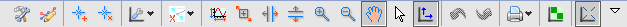

The plot views in DAWN have a specific set of toolbar actions to assist in the data viewing process. These actions are include standard plotted data manipulations such as zooming, panning and the placing of annotations on the plot. A full description of these actions is given below.

|conigicon| Configure Settings...
---------------------------------

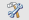

The configure settings... actions brings up the configure graph settings dialog.  This dialog allows parameters related to the graph, axis, traces, annotations and regions of interest (ROI) to be edited, customising the appearance of the graph. A tab will only be shown if at least one of the objects is shown on the graph (i.e. there will be no ROI tab if there are no ROIs on the graph).

*The Graph Tab*

The graph tab allows the graphs title (and its font and colour) to be changed or removed.

*The Axes Tab*

Allows the following to be changed for each axis:

* The axis appearance (title, font, colour)
* Whether it has a log scale
* Manually set the axis ranges
* Turn grid lines on and off

*The Traces Tab*

For each 1D trace the following can be customised:

* Trace Name
* Trace Style (Line/Points/Colour/Thickness...)
* Whether error bars are shown
* Turn grid lines on and off
* And the option to export the data to text

For each 2D image trace the following can be customised:

* Trace Name
* Histogram levels
* Invalid data bounds

*The Annotation Tab*

For each annotation:

* Name
* Font and Colour
* Whether the name, sample information and position are shown on the plot

*The Region Tab*

For each ROI:

* Name
* Colour and transparency
* Whether its mobile
* Whether its name, region and vertex values are displayed
* Its location can also be edited

|legicon| Show Legend
---------------------

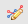

Shortcut action to show or remove the legend from the plot. Particularly useful when plotting a large number of 1D traces.

|annicon| Add/Remove Annotations
--------------------------------

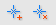

Annotations are a way of adding labels to the plot.

Clicking the Add Annotation... action brings up a dialogue box which allows the label parameters to be set. These parameters include:
* the label text
* the colour and font
* whether the text, position and sample information are shown in the annotation 

Once an annotation has been placed it can be re-positioned by clicking and dragging (both the text label and the region pointed to in the data). The parameters of the annotation can be edited by using the Configure Settings... action.

Remove Annotation... opens a dialogue box which allows the selection of the annotation to be removed.

|ploticon| Plotting Tools
-------------------------

.. |ploticon| image:: images/plot-tool-any.png

The contents of this dropdown action change depending on whether the data plotted is 1D (traces) or 2D (images). A full description of these tools can be found in the 1D/2D tools section of this document.

|regionicon| Remove (All) Regions
---------------------------------

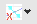

These actions are used remove regions of interest (ROI) from the plot view. Remove Region... opens a dialogue which allows a specific ROI to be selected. Remove All Regions... removes all ROIs from the plot view.

Zoom/Panning Actions
--------------------

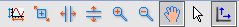

DAWN contains a large selection of actions to make viewing specific regions of data traces/images as simple as possible:

* Perform Auto Scale: Resets the x and y ranges to display all plotted data
* Rubberband Zoom: Zooms to the area specified by a dragged rectangular area
* Horizontal Zoom: Leaves the y axis range unchanged, only zooms on the x axis
* Vertical Zoom: Leaves the x axis range unchanged, only zooms on the y axis
* Zoom In: Zooms in centred around the position of the mouse pointer
* Zoom Out: Zooms out centred around the position of the mouse pointer
* Panning: Clicking in the plot area allows the data to be dragged around. Very useful when zoomed in.
* None: Returns the mouse pointer to its normal state, removing any special action (zoom, pan, draw ROI, etc...)
* Rescale axis when plotted data changes: Toggles between automatic rescaling being on and off.  Auto rescale is very useful when plotting data of different types, but turning it off can help when focussing on specific features of the data (e.g. slicing through a data set while zoomed in).

|undoicon| Undo/Redo Actions
----------------------------

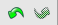

These actions allow the last performed action (zoom, pan, annotation addition...) to be undone and redone.

|printicon| Print Actions
-------------------------

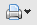

The print action dropdown contains several actions to do with printing and saving a plot:
* Save Plot Screenshot As...: Allows the plot to be saved as an image file
* Copy to Clipboard: Copies an image of the current plot to the clipboard
* Print Plot: Opens the printing dialogue
* Print Scaled Plot: Allows the size of the image to be set before printing

1D/Trace Specific Actions
-------------------------

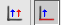

* Plot data a separate plots: Adds all selected data sets as individual traces
* Plot using first data set as x axis: First data set will be x axis. All other data sets will be plotted against this data set. All data sets plotted in this mode must have the same number of data points.

2D/Image Specific Actions
-------------------------

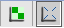

* Rehistogram on zoom in or zoom out: Adjusts the contrast of the image
* Keep aspect ration: Shows image with correct aspect ratio. When turned off the image fills the entire available area

|viewicon| View Menu Actions
----------------------------

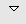

The view menu is another way to access the plot tools and actions specific to 1D or 2D plots. Additional actions in this menu include:

* Color: Allows the colour map to be chosen for image data
* Image Origin: Sets which corner is used as the origin for the image co-ordinate system (default is top left)
