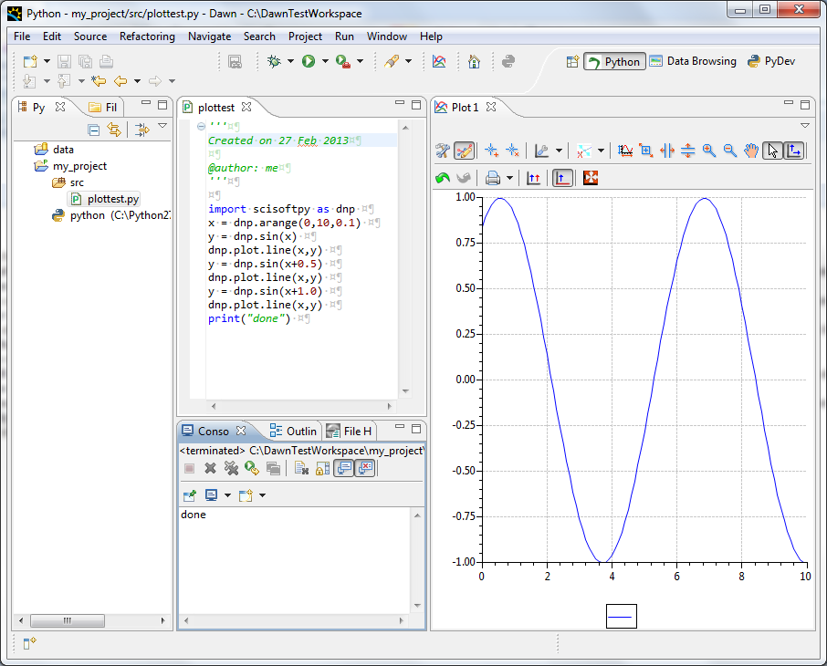

Python Perspective
==================

The Python Perspective is set up to make using the Python and Jython consoles and all their features as easy as possible.

Perspective Layout
------------------

The Python perspective combines four common views to simplify using python/jython scripts to analyse and visualise data.

The views found in this perspective are:

* *Pydev package explorer* (related to the project explorer seen in other perspectives). This view contains all the source code and scripts in a python/jython project and allows scripts to be run using the right-click “Run As” menu.
* *Source code editor* (related to the file editor seen in other perspectives).  Displays any source code or scripts opened in the project. Since this editor is taken from the PyDev perspective of the powerful Eclipse IDE syntax highlighting and code completion are included.
* *Console*. Displays the output from scripts or can be used as an interactive python/jython interpreter
* *Plot 1*. The default plot to which data is sent by the scisoftpy module

Using the interactive console - setting up the interpreter
----------------------------------------------------------

In the console view ( Should be bottom centre in a clean perspective), click on the *Open Console* icon (The button at the top right of the Console View) and select *PyDev Console* from the available options. Finally choose either *Python Console* or *Jython Console* and then click OK.

The familiar three chevrons *>>>* should appear in the console view as well as some notifications that the environment is being configured. When text stops appearing and the cursor is flashing next to the chevrons the interpreter is ready to use.

scisoftpy
---------

The Scisoftpy module adds lots of functionality to the Jython terminal, including numpy like array functionality, various loading mechanisms for lots of file types and plotting which is available in this framework. 
The Scisoftpy module should be imported as default (under the short name *dnp*) but if not to get access to this you need to import the scisoftpy module manually by typing: 

*import scisoftpy as dnp*

then press return. This May take some seconds to complete, and some text could appear in the window. 
Once the prompt re-appears type *help(dnp)* to see some of the available commands.

Line plot
---------

A useful tool scisoftpy gives is the ability to plot data. The following commands will create some data and then plot it to the "Plot 1" view which is to the right of the perspective.

| *a = dnp.arange(0,10,0.1)*
| *b = dnp.sin(a)*
| *dnp.plot.line(a,b)*

This will show a plot of a sine curve.

Image plot
----------

You can also use scisoftpy to plot images or 2D arrays of data using the following commands:

| *im = dnp.random.rand(100,100)*
| *dnp.plot.image(im)*

This will give an image plot of some noise. You can instead plot the same data as a surface by using the following command:

*dnp.plot.surface(im)*

Use the mouse to rotate the surface plot as required.

Creating a new project
----------------------

Projects are a great way to organise source code and scripts required for data analysis. The instructions below work the same for python and jython.

To create an example Pydev project use the following steps:

Go to:

*File -> New -> PyDev Project*

Give the project a name, such as PythonTest select the Python project type and select the *Create 'src' folder and add it to the PYTHONPATH?* option, then click *Finish*. 
You may be prompted to set up the Python interpreter or go to the Pydev perspective, in both cases say *No*.

Creating a simple script
************************

Open the PyDev Package Explorer, and expand the new PythonTest project you have just created.

Inside this project is a *src* directory, which is where your scripts should live, right click on this directory and choose:

| *New -> PyDev Module*

Leave the package field blank, but fill in the name with something like plottest and leave the template as Empty and press *OK*. 
This will open a new editor window called plottest, which is where the script will be written. Add the following code into this file under the initial comment:

| *import scisoftpy as dnp*
| *x = dnp.arange(0,10,0.1)* 
| *y = dnp.sin(x)*
| *dnp.plot.line(x,y)*
| *y = dnp.sin(x+0.5)*
| *dnp.plot.line(x,y)*
| *y = dnp.sin(x+1.0)*
| *dnp.plot.line(x,y)*
| *print('done')*

Then save this work by clicking:
| *File -> Save* 
or by pressing *Ctrl-S*. 

Running a script
****************

Now we have the script written we want to run it, and this is done using the standard method described below.

Right click on the python script 'plottest.py' in the PyDev Package Explorer and click on:

*Run As -> Python Run*

Various test will appear in the console as things are set up, but you should see a sine plot appear in the Plot 1 view as well as the 'done' statement at the bottom of the console which we asked to be printed in the script.

Running a script in debug mode
******************************

One of the really powerful features of this environment is the ability to Debug code. To do this you will need to say where you want the code to stop with a breakpoint. This can be added by right clicking just to the left of a line of code and choosing *Add Breakpoint*.
Add a breakpoint next to the *x = ...* line of code. 
Now right click on the file again in the pyDev Package Explorer and this time choose *Debug As -> Python Run* . 
You will get prompted to Change perspective but in this case we don't want to so click *no* . 
The code will have stopped on the *x = ...* line just as we requested, and a new view(Debug) will have been brought up.

 Move this view to below the Plot 1 view for the time being.
 
Stepping with the debugger
**************************
 
To execute the next line of code you need to get the debugger to step forward, this is done by pressing the *step over* button at the top of the Debug view, or by pressing *F6* while the Editor is selected. Use one of these methods to step down to the second *y = ...* line. 
You should have seen the plot update when you asked the debugger to execute the *dnp.plot...* command. Now finish off running the script by stepping through the rest of it. 
Once you have finished the Debug view will show that the process has terminated.

Using the debugging perspective
*******************************

There is a special perspective which helps when Debugging. Debug the script again, but this time choose yes when prompted change to the Debugging perspective. 
One of the main features of this Perspective is the Variables view. This shows all the things which are in the namespace at the point where the debugger has stopped. Step through using the *step over* button or the *F6* key until the first plot command. 
Now look in the Variables view and you should see both the *x* and *y* variables, if you click on them some basic information about them will be displayed. Now step forward a few more times, and you will see the y variable change, and this is highlighted in the view. 
Run through the rest of the script using the *resume* button on the Debug view or *F8* in the editor window, and then return to the Python perspective through the button at the top of the main window, or by click:

*Window -> Open Perspective -> Other -> Python*